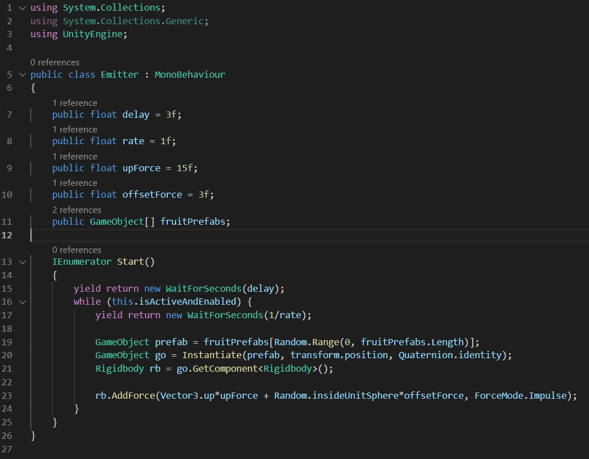
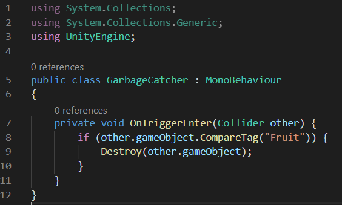
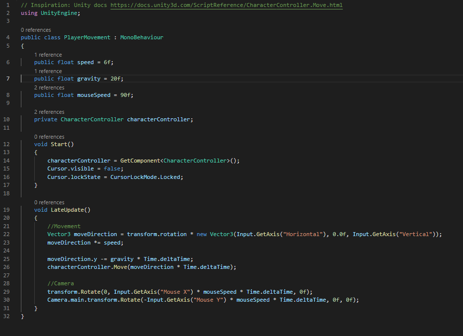
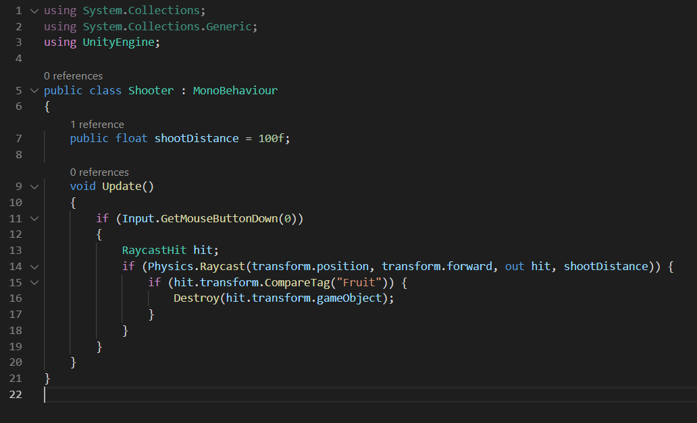
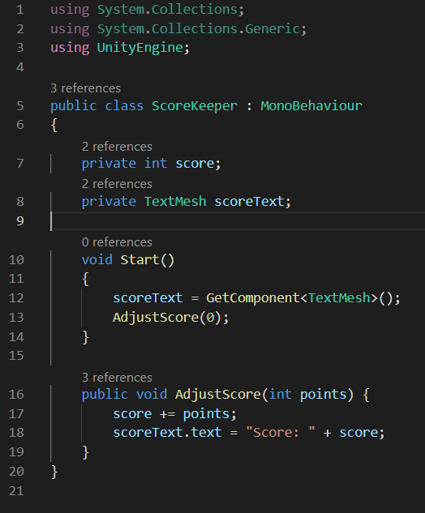
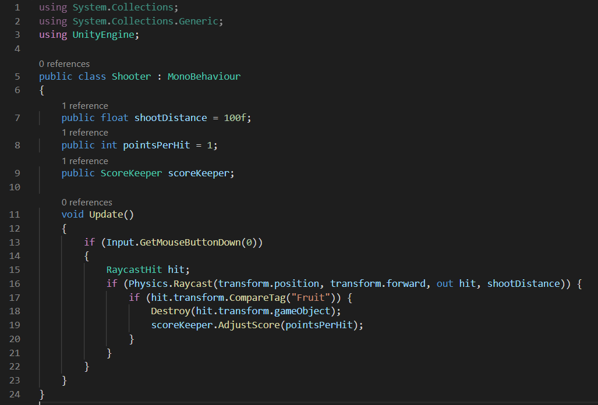
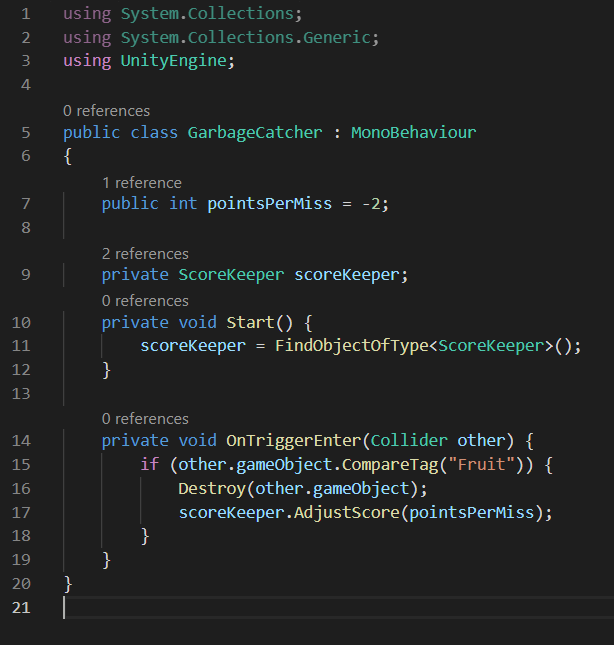

# Carolina AR/VR (Fall 2019)

## Workshop 2 (2019-09-10)

### Note: this repository contains a completed version of this project. If you wish to do the workshop yourself, please create a new Unity project of your own, and follow along with this readme to create your own version of the game! You can always refer back to this completed project if you get stuck.

The premise of this workshop is to make a simple game inspired by Fruit Ninja, but in 3D and with a gun. We will be making everything from scratch, and will omit some UX niceties in order to hopefully finish within 2 hours. We will try to focus on the fundamental principles of scripting and working with the Unity editor.

Feel free to tweak things to make it your own! Bonus: try making multiple copies of some of the scripts (like Emitter.cs) in your scene and see what happens. You can tweak their parameters individually from the Unity editor!

1. **Basic scene setup**

    1. Create a new empty project (“3D”).

    2. **Warning: any edits made to the scene while in Play mode will be erased upon exiting Play mode!**

        1. Go to Edit -> Preferences -> Colors -> General

        2. Change “Playmode tint” to something really obvious, like a light neon pink.

2. **Creating our fruit prefabs**

    3. Create 3 - 4 new GameObjects in the scene hierarchy, choose a combination of Cubes, Spheres, Cylinders, or Capsules.

        3. (Right click in the Hierarchy window, then hover over “3D Object”)

        4. Name them appropriately as different fruit.

        5. Hold shift and click to select all of them at once, then add a Rigidbody component to all of them at once.
    
            1. (click the “Add Component” button in the Inspector window)

        6. With all of the fruit selected, click the dropdown called “Tag” right by their name in the Inspector window, and then “Add Tag”, then create a new tag called “Fruit” and apply it to the GameObjects.

    4. Turn them into prefabs:

        7. Right click in the Project/Assets window and create a new folder called “Prefabs”.

        8. Drag the fruit GameObjects from our scene Hierarchy into this new folder in the Project window. If successful, their names should turn blue.

        9. Delete the original GameObjects from the _scene Hierarchy_ (not the new prefabs in the Project window!)

    5. Give them colors via custom “Materials”:

        10. (A material basically defines how the objects it is applied to looks (along with their 3D model/mesh and some other factors))

        11. In the root asset folder of the Project window, create a new folder called “Materials”

        12. In the materials folder, right click to create a new material for each fruit prefab, and name them appropriately.

        13. One at a time, select a material, and click the white box in the Inspector labelled “Albedo” to open a color picker, and select an appropriate color for the fruit.

        14. One at a time, select a fruit prefab from the “Prefabs” folder, find its "Mesh Renderer" component in the Inspector, locate the "Materials" section (expand it if need be), and left-click the circle/dot icon to the right of "Element 0" and "Default-Material". This should open a small "Select Material" window, from which you can select the appropriate Material for this fruit Prefab.

3. **Creating a fountain of fruit!**

    6. Create a new “Scripts” folder, and create a C# script inside it called “Emitter” 

        15. (Note: omit any file extension, Unity will add .cs automatically)

    7. Double click the new script to open it in your code editor

        16. (Note: you can go to Edit -> Preferences -> External Tools to change which code editor Unity links with)

    8. Write the following script for Emitter.cs:

    

    9. Save the script and return to Unity.

    10. Create an empty GameObject named “Emitter” in the scene Hierarchy, then attach your script to it by dragging the Emitter script from the Project window onto the Emitter GameObject in the Hierarchy.

    11. Add references to our fruit prefab:

        17. Select the Emitter GameObject in the Hierarchy window.

        18. In the Inspector window, expand the “Fruit Prefabs” field of our Emitter Component by clicking the triangle.

        19. Set the Size field to the number of fruit prefabs you made earlier.

        20. Drag each fruit prefab from the Project window into one of the slots created by the Fruit Prefabs array of our Emitter Component in the Inspector, one by one.

    12. Drag our new Emitter GameObject in front of the camera, so we can see it.

    13. Test our changes by entering Play mode, you should see a fountain of multi-colored objects! (Try switching to the Scene view tab instead of the Game view tab if you can’t find our fountain)

        21. (Note: don’t stay in Play mode too long, it might start getting laggy!)

4. **Cleaning up our mess of fallen fruit**

    14. Create a big ‘trigger plane’ below our Emitter:

        22. Create a “Plane” GameObject in the Hierarchy, call it “GarbageCatcher”, then select it and turn your attention to the Inspector window.

        23. On the Component called “Transform”, click the gear icon and hit “Reset” to reset its position to the world origin (0, 0, 0)

        24. Then change the Scale on the Transform to 100 in the X and Z axes, but keep it at 1 in the Y axis.

        25. Change the Y value of the position to something line -20, to put it far enough underneath our Emitter object.

        26. Uncheck (disable) the box next to the “Mesh Renderer” component to disable rendering for the plane.

        27. On the “Mesh Collider” component check (enable) the “Convex” and “Is Trigger” boxes.

    15. In the Scripts folder of the Project window, create a new “GarbageCatcher” script and open it.

    16. Write the following GarbageCatcher.cs script:

    

    17. Save it and return to Unity.

    18. Drag our new GarbageCatcher script from the Project window onto our GarbageCatcher GameObject in the scene Hierarchy.

    19. Enter Play mode, and ensure the falling fruit is destroyed when it touches the GarbageCatcher plane.

5. **Create a player to control our camera**

    20. Create another Plane GameObject in the scene Hierarchy, reset its position as before, but leave its scale as (1, 1, 1). This will be our floor.

    21. Create a Capsule GameObject and rename it “Player”.

        28. Drag it up to position it slightly above the floor plane we just created.

        29. Add a “Character Controller” component to the Player.

        30. Drag the existing “Main Camera” GameObject onto the Player, making it a child of the Player.

    22. Create a new script called “PlayerMovement”, attach it to your Player GameObject, and then open it in your code editor.

    23. Write the following code for PlayerMovement.cs:

    

    24. Save the script, return to Unity, and enter Play mode to test.

6. **Allow our player to shoot the fruit**

    25. Create a new script called “Shooter”, and attach it to the “Main Camera” GameObject, which is a child of our “Player” GameObject.

    26. Create a reticle to help us aim:

        31. Right click on the Main Camera in the scene Hierarchy and create a 3D Object -> Sphere underneath it. This should make the sphere a child of the camera. Rename it to “Reticle”

        32. Change the Scale property of the Transform component on the new sphere to (0.01, 0.01, 0.01)

        33. Set the Z field of the Position property of the Transform component to 0.5. This should place it right in-front of our player’s eyes, helping us aim.

        34. __Important:__ Delete the “Sphere Collider” component from the Reticle by clicking on the gear icon next to the component and clicking “Remove Component”.

    27. Open the Shooter script in your code editor, and write the following code:

    

    28. Save the script, return to Unity, and test your changes by entering Play mode. You should now be able to delete fruit by clicking when your reticle is hovered over them!

7. **Track your score**

    29. Create a 3D text object to show our score count:

        35. Right click an empty area in the scene Hierarchy, go to “3D Object” -> “3D Text”, and rename the new object to something like “ScoreKeeper”

        36. Using the Move Tool in the Scene window, drag the new text out in front of the camera, and behind the Emitter object, until you can read the sample “Hello World” text clearly from the Game view without entering Play mode.

    30. Create a new “ScoreKeeper” script, attach it to our ScoreKeeper GameObject, open the script in your code editor, and write the following code:

    

    31. Save the script, return to Unity, enter Play mode. The text should now say “Score: 0”

    32. Now we need to modify some other scripts to adjust our score when things happen! In order to do this, we will need _References_ to the _Instance_ of our ScoreKeeper script we created. There are many ways to do this, but we will look at two possibilities here for our Shooter and GarbageCatcher scripts.

        37. Option A): demonstrated with Shooter.cs

            2. (We will add a “_public ScoreKeeper scoreKeeper_” field to our Shooter script, and give it a reference to our ScoreKeeper instance via the editor.)

            3. Open Shooter.cs in your code editor, and modify the code like so (adding the public field, and calling the AdjustScore function):

            

            4. Return to Unity, select the Main Camera GameObject in the Hierarchy, find the new empty “Score Keeper” field on our “Shooter (Script)” component.

            5. Drag the ScoreKeeper GameObject from the scene Hierarchy into this new field on our Shooter component attached to our Main Camera.

            6. Enter Play mode and test our code by changing things. Your score should go up when you shoot fruit!

        38. Option B): demonstrated with GarbageCatcher.cs

            7. (Since we only have one ScoreKeeper in our scene (currently), we can have our script find the reference for us when it Start(s), so that we don’t have to manually assign it)

            8. Open GarbageCatcher.cs in your code editor, and modify the code like so (adding the private field, finding the ScoreKeeper object on Start, and calling the AdjustScore function):

            

            9. Return to Unity, enter Play mode, and see if our score does down when the fruit falls away unshot. You shouldn’t need to assign anything this time!

            10. __Note:__ can you identify where this method might go wrong?